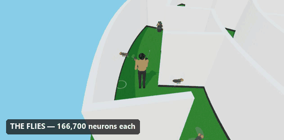

# Fruit fly maze game

A man with a katana walks a circular maze, hunting flies. He is steered by fly
brain circuitry. So are they.


Runs in a browser with **no build step, no npm install and no network**. Clone
it, start a static server, open the page.

```bash
node web/walker/tools/serve.mjs      # then open http://localhost:8173/
```

## Your pictures on the walls

The maze is a gallery, and it ships empty on purpose. **Drop image files into
`web/walker/art/` and they become the paintings**, framed to their own shape and
hung along the curved walls.

```bash
cp ~/wherever/*.jpg web/walker/art/
node web/walker/tools/serve.mjs      # rebuilds the gallery on every boot
```

Each picture gets a frame cut to its own pixel dimensions, hung on the same
1.15 m diagonal so a tall portrait and a wide landscape read as the same size of
object. Long walls take two or three, and every wall between two rings is hung
on **both** faces, so there is art whichever side you walk. About 130 fit. With
none at all, everything still works — the walls are just bare. Details in
[`web/walker/art/README.md`](web/walker/art/README.md).

## The cameras

`C` cycles five of them. Three, recorded separately:

**Free view** — orbit the whole maze from outside. The flecks of colour on the
walls are the pictures.


**Over the shoulder** — behind the character, hunting. This is the one at the
top of this page.

**POV** — first person, at 1.666 m eye height and 100 degrees horizontal.


The other two are `follow` and `duel`, which frames the character against
whichever fly is being engaged. Every one of these was recorded by
`tools/capture.mjs`; nothing was filmed by hand.

Two real paintings ship with the repo, so a fresh clone is not a blank gallery:
Vermeer's *Girl with a Pearl Earring* (c. 1665) and Arnold Böcklin's
*Self-Portrait with Death Playing the Fiddle* (1872). Both are public domain —
that is the test for anything going in. The Vermeer is the one hanging on the
right in the POV clip. The rest of the pictures in these recordings are
generated placeholders; the gallery is meant to be yours.

## Night: the maze as a library after hours

Press `N`. The sky goes out and the sun with it, the boards and panelling go
dark, and what is left is the pictures — each under its own small brass lamp,
each dropping a pool of lamplight on the floor beneath it. The corridors between
them go nearly black, so the place reads as a sequence of lit things rather than
a lit room.

**There are no extra lights in it.** That is the whole trick, and it is worth
saying because the obvious implementation is one point light per picture — and
with a hundred pictures that is a hundred lights, which in three.js means a
shader whose cost is paid on *every* surface in the scene whether a picture is
near it or not. Instead:

- each picture **lights itself**, by taking its own texture as an `emissiveMap`.
  A lit painting is mostly its own colours brightened, which is exactly what an
  emissive map does.
- the lamp above it is a small emissive bar; the pool beneath it is a disc with
  a drawn radial falloff on additive blending. Both are geometry pretending to
  be light, both are instanced, and together they are two draw calls for the
  whole gallery.

So the night is entirely material. See
[`web/walker/render/night.js`](web/walker/render/night.js).

### Plates for the walls

`libraryArt.py` draws the kind of thing that hangs in a college library —
botanical specimens, star charts, classical elevations, marbled endpapers,
geometric constructions, coastal charts — on aged paper in iron-gall ink:

```bash
python web/walker/tools/libraryArt.py 24   # into art/generated/
node web/walker/tools/artManifest.mjs
```

Nothing is loaded to make them; every plate is drawn from scratch, so there is
no licence on any of it. They go in `art/generated/`, which is gitignored like
the rest of the gallery and kept separate because it is regenerated wholesale —
these are not pictures anybody chose.

## Controls

| | |
|---|---|
| `C` | camera — follow, over-the-shoulder, POV, duel, top |
| `N` | **night** — the maze as a library after hours |
| `1`–`6` | swap character |
| `H` | hide the overlays |
| `L` | remove the compass landmark, and watch the heading drift |
| `space` | pause · `R` reset · `F` hold fire |

## The flies



The `duel` camera frames whichever fly is being engaged. They are 534 mm here —
214 times life size, and about 30% of the character's height — because a real
*Drosophila* at this scale would be a single invisible pixel.

## Where this comes from: the male CNS connectome

In 2026 Google Research and Janelia's FlyEM team released a map of the **entire
male fruit fly central nervous system** — at the time the largest brain map by
number of neurons. This project is built on that release, `MaleCNS v1.0`,
CC BY 4.0.

What makes it the useful one is not the neuron count but the **coverage**: it
includes the central brain, the optic lobes *and* the ventral nerve cord — the
fly's spinal cord. That is what lets you trace a path from a visual input all
the way to a motor output, which is precisely what this game walks on.

### The numbers, measured rather than quoted

`amfly/data/loader.py` reads the released files directly and
`tests/test_loader.py` asserts what it finds:

| | |
|---|---|
| neurons | 166,700 |
| **connections** | 25,582,938 |
| **synapses** | 124,177,617 |
| cell types | 11,691 |
| descending neurons (brain → cord) | 1,314 |
| VNC leg motor neurons | 708 |

**Those middle two are different quantities and are constantly conflated**,
including in some coverage of the release, which reports "125 million synaptic
connections" — merging a synapse count with a connection count that is five
times smaller. A connection is a pair of neurons that talk; a synapse is one
contact, and a connection is usually several. The repo keeps them apart on
purpose and fails a test if they drift.

### What the game actually takes from it

Twelve named cell types, each standing for a population the release describes:

| | |
|---|---|
| `EPG` `PEN` `ER` | the head-direction compass: a ring attractor, rotated by angular velocity, pinned by a visual landmark |
| `FC2` `PFL3` | goal direction, and the comparison that turns heading error into a turn |
| `DNa02` `DNa01` `DNp09` `MDN` | descending neurons — the brain's four wires down to the cord |
| `LoVP92` `AOTU012` | the male-specific and sexually dimorphic pair, which only a *male* connectome offers |
| `LegCPG` | six coupled oscillators standing in for the 708 leg motor neurons |

`LoVP92` and `AOTU012` are the reason the male map matters rather than the
female one released earlier: having both sexes mapped is what makes the
differences visible in the first place. The release highlights `AOTU008` as its
worked example of dimorphism — the male cell carries two extra projections.

### Where the resemblance stops

**The walker's weights are hand-tuned, not measured.** `brain/connectome.js`
models about ten populations with gains chosen so the figure walks well. The
*topology* — who talks to whom, and with what sign — follows the published
circuit; the numbers on the arrows do not come from the connectome.

The half of this repo that does use the real data is `amfly/`, which loads the
1 GB weights table, applies Dale's law per presynaptic neuron, and runs six
copies of all 166,700 neurons as leaky integrate-and-fire networks that stay
bit-identical until something is done to one of them.

And the gait is authored. Spike-to-muscle-force has no established mapping, so
the 708 leg motor neurons in the dataset are represented by six phase
oscillators — **an engineered gait modulated by circuit activity**, not "the
connectome walks the body". `docs/roadmap-3d.md` sets out what closing that gap
would actually take, and why nobody has.

Explore the dataset yourself at
[male-cns.janelia.org](https://male-cns.janelia.org/).

## What is real, and what is mine

The project is careful about this line, and
[`docs/walker.md`](docs/walker.md) draws it in detail.

**Follows published *Drosophila* circuitry:**

- **Head direction** is a ring attractor over 16 EPG wedges, rotated by a PEN
  pathway from angular velocity and pinned to a visual landmark by ER input.
  Take the landmark away with `L` and it dead-reckons, because that is what
  happens.
- **Steering** reads PFL3 at ±90° offsets, so the left-minus-right difference is
  proportional to `sin(goal − heading)`, and feeds DNa02 — whose published
  relationship to subsequent rotational velocity is linear.
- **Escape** is LPLC2 loom detection driving the giant fiber at a fixed ~5 ms
  latency, committed once triggered.
- **Search** is a correlated random walk with run-and-tumble reorientation,
  switching to area-restricted search when a target is lost.

**Mine, and not pretending otherwise:**

- Six coupled phase oscillators stand in for the 708 VNC leg motor neurons.
  Spike-to-muscle-force has no established mapping, so this is **an engineered
  gait whose parameters are modulated by circuit activity** — not "the
  connectome walks the body".
- The weights in `brain/connectome.js` are hand-tuned for a ~10-population
  model, not measured synapse counts. The *topology* follows the published
  circuit; the gains are tuned.
- The maze, the character, the flies, the weapons and the scoring are all
  authored.

Counts come from the **MaleCNS v1.0** connectome (Janelia FlyEM + Google
Research, CC BY 4.0), measured from the released files rather than from press
coverage: 166,700 neurons, 25,582,938 connections, 124,177,617 synapses, 1,314
descending neurons, 708 VNC leg motor neurons. Those first three are different
quantities and are routinely conflated.

## Things that were measured rather than guessed

- **Double support is 24% of the gait cycle** — and it is *derived*, not dialled.
  The two tripods of the fly CPG sit half a cycle apart, and a 0.62 duty factor
  gives `2 × (0.62 − 0.5)`. That is the 20–25% gait labs measure, falling out of
  a fly circuit driving human kinematics without either being adjusted to suit.
- **Momentum.** Borrowed from Godot's `CharacterBody3D`: `move_toward` for
  acceleration, `move_and_slide` for contact. From 1.75 m/s the character stops
  in 0.158 s over 0.132 m, with 0.0° of drift between facing and travel through
  a 2 rad/s turn. Sliding along walls rather than being shoved out of them
  halved the time spent in contact, 11% → 5%.
- **A 5 ms reflex with no target model beats a predictive solver** — but only
  when the jink clears the target's own width inside the projectile flight time.
  The first write-up missed that second half, and
  [`docs/negative-results.md`](docs/negative-results.md) records what happened
  when the arena changed underneath it.

## Tools

Everything runs headless in node, against the same modules the browser loads.

```bash
node web/walker/tools/validate.mjs   # the circuits, in isolation
node web/walker/tools/smoke.mjs      # the whole scene, no renderer
node web/walker/tools/maze.mjs       # generation, solving, and the full march
node web/walker/tools/experiment.mjs # the escape-reflex benchmark
node web/walker/tools/capture.mjs all  # re-record the camera GIFs
```

`capture.mjs` drives Chrome over the DevTools Protocol through node's built-in
WebSocket and assembles the GIF with Pillow — no puppeteer, nothing installed.

## Also in here

`amfly/` is the other half of the project: six copies of the MaleCNS connectome
run as leaky integrate-and-fire networks, bit-identical until something is done
to them. `godot-lab/` is a headless Jolt bench used to measure what a knocked-
down body does, because the walker has no balance model yet.

## Credits

MaleCNS v1.0 — Janelia FlyEM and Google Research, CC BY 4.0.
three.js r169, MIT, vendored for offline use.
Licence: see [`LICENSE`](LICENSE).
